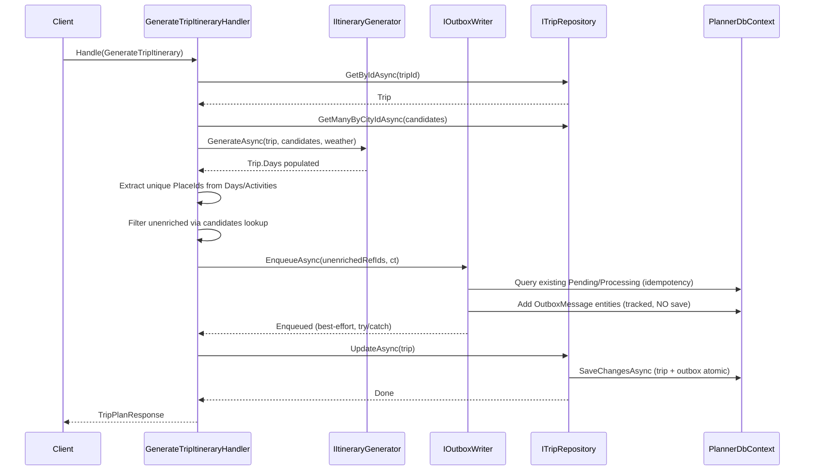
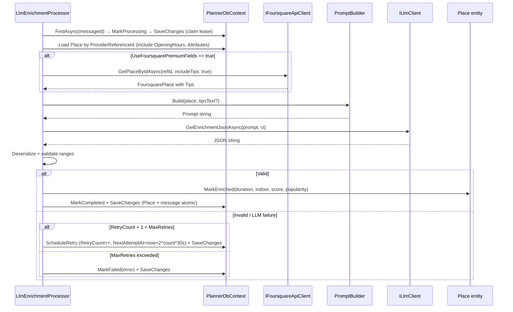

# Design: Flow 3 — LLM Background Enricher

## Technical Approach

After `IItineraryGenerator.GenerateAsync` populates `Trip.Days`, the handler extracts unique `PlaceId`s from all activities, filters to unenriched places (`IsEnriched == false`), and calls `IOutboxWriter.EnqueueAsync` with their `ProviderReferenceId`s — all before `tripRepository.UpdateAsync` calls `SaveChangesAsync`, so the Outbox insert and trip save are atomic. A `LlmEnrichmentBackgroundService` (hosted service) polls pending `OutboxMessage` rows, reclaims stuck leases, and delegates each to `ILlmEnrichmentProcessor`. The processor marks the message `Processing`, optionally fetches Foursquare tips (gated by `UseFoursquarePremiumFields`), builds a prompt, calls `ILlmClient` (wrapping MEAI `IChatClient`), parses/validates JSON, calls `Place.MarkEnriched`, and marks the message `Completed` — or schedules a retry with exponential backoff, or marks `Failed` after max retries.

## Architecture Decisions

| Decision | Choice | Alternatives | Rationale |
|----------|--------|-------------|-----------|
| OutboxMessage location | Infrastructure/Outbox | Domain/AggregatesModel | Not a domain aggregate; pure persistence/messaging concern. Uses `Guid` PK, incompatible with Domain `Entity` base (`long Id`). |
| IOutboxWriter contract | Takes `IEnumerable<string>` refIds | Takes `OutboxMessage` entities | Domain port stays clean — no knowledge of OutboxMessage internals. |
| OutboxWriter save strategy | Tracks entities, no SaveChanges | SaveChanges internally | Handler's `UpdateAsync` provides atomic save — Outbox insert + trip update in one transaction. |
| Processor DB access | `PlannerDbContext` directly | Via `IOutboxMessageRepository` | Processor updates both OutboxMessage and Place in one `SaveChangesAsync`; repo indirection adds no value here. |
| IChatClient registration | API Program.cs (composition root) | Infrastructure registration | MEAI.OpenAI package in API; Infrastructure only needs Abstractions for `LlmClient` adapter. |
| Status enum storage | `HasConversion<string>()` | Default int storage | DB readability for manual Outbox inspection and ad-hoc queries. |
| BackgroundService scoping | `IServiceScopeFactory` per iteration | Inject Scoped directly | Hosted services are singletons; must create scopes for Scoped `PlannerDbContext`/processor. |
| Lease reclamation timing | Before each poll cycle | Separate timer | Simplest; ensures stuck messages are reclaimed before picking new work. |

## Sequence Diagrams

### (a) Handler Triggering Outbox



### (b) BackgroundService Loop

```mermaid
sequenceDiagram
    participant BS as LlmEnrichmentBackgroundService
    participant SF as IServiceScopeFactory
    participant Repo as IOutboxMessageRepository
    participant Proc as ILlmEnrichmentProcessor

    loop while !stoppingToken.IsCancellationRequested
        BS->>SF: CreateScope()
        BS->>Repo: ReclaimExpiredLeasesAsync(300s)
        Note over Repo: UPDATE Processing→Pending WHERE UpdatedAt < now-300s
        BS->>Repo: GetPendingAsync(batchSize)
        Note over Repo: WHERE Status=Pending AND (NextAttemptAt IS NULL OR <= now) ORDER BY CreatedAt
        Repo-->>BS: List<OutboxMessage>
        loop each message
            BS->>Proc: ProcessAsync(message.Id, ct)
            Note over BS: catch + log per message; continue loop
        end
        BS->>BS: Task.Delay(pollingInterval, stoppingToken)
    end
```

### (c) Processor Per-Message Flow



## File Changes

| File | Action | Description |
|------|--------|-------------|
| `Domain/Ports/ILlmClient.cs` | Create | Port: `Task<string> GetEnrichmentJsonAsync(string prompt, CancellationToken ct)` |
| `Domain/Ports/IOutboxWriter.cs` | Create | Port: `Task EnqueueAsync(IEnumerable<string> placeProviderReferenceIds, CancellationToken ct)` |
| `Domain/AggregatesModel/Place.cs` | Modify | Add `FamilyFriendlyScore` (default 3), `Popularity` (default 0.5), `IsEnriched` (default false); add `MarkEnriched(...)` with range validation |
| `Infrastructure/Outbox/OutboxMessage.cs` | Create | Entity with Guid PK, state transition methods (MarkProcessing, MarkCompleted, ScheduleRetry, MarkFailed, Reclaim) |
| `Infrastructure/Outbox/OutboxMessageStatus.cs` | Create | Enum: Pending, Processing, Completed, Failed |
| `Infrastructure/Outbox/OutboxWriter.cs` | Create | Implements `IOutboxWriter`; idempotency check + entity tracking (no save) |
| `Infrastructure/Outbox/IOutboxMessageRepository.cs` | Create | Internal interface: `GetPendingAsync`, `ReclaimExpiredLeasesAsync` |
| `Infrastructure/Outbox/OutboxMessageRepository.cs` | Create | Implements polling queries on `PlannerDbContext` |
| `Infrastructure/Configurations/OutboxMessageConfiguration.cs` | Create | EF config: PK, indexes, status string conversion, defaults |
| `Infrastructure/LLM/LlmApiOptions.cs` | Create | Config: `ApiKey`, `BaseUrl`, `Model` (SectionName = "LlmApi") |
| `Infrastructure/LLM/LlmEnrichmentOptions.cs` | Create | Config: `UseFoursquarePremiumFields` (false), `MaxRetries` (3), `PollingIntervalSeconds` (30), `LeaseTimeoutSeconds` (300), `BatchSize` (10) |
| `Infrastructure/LLM/LlmClient.cs` | Create | Implements `ILlmClient` via MEAI `IChatClient` with JSON response format |
| `Infrastructure/LLM/PlaceEnrichmentPromptBuilder.cs` | Create | Static prompt builder: name, categories, hours, optional tips |
| `Infrastructure/LLM/PlaceEnrichmentResponse.cs` | Create | DTO for JSON deserialization + range validation |
| `Infrastructure/LLM/ILlmEnrichmentProcessor.cs` | Create | Internal interface: `Task ProcessAsync(Guid messageId, CancellationToken ct)` |
| `Infrastructure/LLM/LlmEnrichmentProcessor.cs` | Create | Orchestrates Foursquare→Prompt→LLM→Parse→MarkEnriched→Complete/Retry/Failed |
| `Infrastructure/Background/LlmEnrichmentBackgroundService.cs` | Create | Hosted service: loop, reclaim, poll, delegate, graceful shutdown |
| `Infrastructure/PlannerDbContext.cs` | Modify | Add `DbSet<OutboxMessage> OutboxMessages` |
| `Infrastructure/Configurations/PlaceConfiguration.cs` | Modify | Add `FamilyFriendlyScore` (default 3), `Popularity` (default 0.5), `IsEnriched` (default false) |
| `Infrastructure/InfrastructureServiceRegistration.cs` | Modify | Register options, `ILlmClient`, `IOutboxWriter`, `IOutboxMessageRepository`, `ILlmEnrichmentProcessor`, `AddHostedService<LlmEnrichmentBackgroundService>` |
| `Infrastructure/SmartTripPlanner.Infrastructure.csproj` | Modify | Add `Microsoft.Extensions.AI.Abstractions` package |
| `Infrastructure/ExternalServices/Foursquare/FoursquareApiClient.cs` | Modify | `GetPlaceByIdAsync` add `bool includeTips = false`; append `,tips` to fields when true |
| `Infrastructure/ExternalServices/Foursquare/IFoursquareApiClient.cs` | Modify | Add `includeTips` parameter to `GetPlaceByIdAsync` |
| `Infrastructure/ExternalServices/Foursquare/Models/FoursquarePlace.cs` | Modify | Add `List<FoursquareTip> Tips` property |
| `ApplicationServices/Handlers/GenerateTripItineraryHandler.cs` | Modify | Inject `IOutboxWriter`; extract unenriched PlaceIds; enqueue before `UpdateAsync`; best-effort try/catch |
| `API/Program.cs` | Modify | Register `IChatClient` via MEAI OpenAI extension |
| `API/appsettings.json` | Modify | Add `LlmApi` and `LlmEnrichment` sections |
| `API/SmartTripPlanner.API.csproj` | Modify | Add `Microsoft.Extensions.AI.OpenAI` package |
| `Infrastructure/Migrations/{ts}_AddLlmEnrichmentOutbox.cs` | Create | EF migration: Place columns + OutboxMessages table |

## Interfaces / Contracts

### Domain Ports

```csharp
// Domain/Ports/ILlmClient.cs
public interface ILlmClient
{
    Task<string> GetEnrichmentJsonAsync(string prompt, CancellationToken ct = default);
}

// Domain/Ports/IOutboxWriter.cs
public interface IOutboxWriter
{
    Task EnqueueAsync(IEnumerable<string> placeProviderReferenceIds, CancellationToken ct = default);
}
```

### Place Entity (Modified)

```csharp
public int FamilyFriendlyScore { get; private set; } = 3;
public double Popularity { get; private set; } = 0.5;
public bool IsEnriched { get; private set; } = false;

public void MarkEnriched(int typicalDurationMinutes, bool isIndoor,
    int familyFriendlyScore, double popularity)
{
    if (familyFriendlyScore < 1 || familyFriendlyScore > 5)
        throw new SmartTripDomainException("FamilyFriendlyScore must be 1-5.");
    if (popularity < 0.0 || popularity > 1.0)
        throw new SmartTripDomainException("Popularity must be 0.0-1.0.");
    if (typicalDurationMinutes <= 0)
        throw new SmartTripDomainException("TypicalDurationMinutes must be > 0.");

    TypicalDurationMinutes = typicalDurationMinutes;
    IsIndoor = isIndoor;
    FamilyFriendlyScore = familyFriendlyScore;
    Popularity = popularity;
    IsEnriched = true;
}
```

### OutboxMessage Entity (Infrastructure)

```csharp
public class OutboxMessage
{
    public Guid Id { get; private set; }
    public string PlaceProviderReferenceId { get; private set; }
    public string? PayloadJson { get; private set; }
    public OutboxMessageStatus Status { get; private set; }
    public int RetryCount { get; private set; }
    public int MaxRetries { get; private set; }
    public DateTime CreatedAt { get; private set; }
    public DateTime? NextAttemptAt { get; private set; }
    public DateTime? ProcessedAt { get; private set; }
    public DateTime UpdatedAt { get; private set; }
    public string? Error { get; private set; }

    public static OutboxMessage Create(string placeProviderReferenceId, int maxRetries = 3);
    public void MarkProcessing();        // Status=Processing, UpdatedAt=now
    public void MarkCompleted();         // Status=Completed, ProcessedAt=now, UpdatedAt=now
    public void ScheduleRetry();         // RetryCount++, Status=Pending, NextAttemptAt=now+2^RetryCount*30s
    public void MarkFailed(string error);// Status=Failed, Error=error, NextAttemptAt=null
    public void Reclaim();               // Status=Pending, NextAttemptAt=null, UpdatedAt=now
}
```

### LLM Response DTO + Validation

```csharp
internal sealed class PlaceEnrichmentResponse
{
    public int TypicalDurationMinutes { get; set; }   // valid: 15-480
    public bool IsIndoor { get; set; }
    public int FamilyFriendlyScore { get; set; }      // valid: 1-5
    public double Popularity { get; set; }            // valid: 0.0-1.0

    public void Validate();  // throws InvalidOperationException if any field out of range
}
```

### Internal Infrastructure Interfaces

```csharp
internal interface IOutboxMessageRepository
{
    Task<List<OutboxMessage>> GetPendingAsync(int batchSize, CancellationToken ct);
    Task ReclaimExpiredLeasesAsync(int leaseTimeoutSeconds, CancellationToken ct);
}

internal interface ILlmEnrichmentProcessor
{
    Task ProcessAsync(Guid messageId, CancellationToken ct = default);
}
```

## Entity & DB Design

**OutboxMessage table (`OutboxMessages`):**

| Column | Type | Constraints |
|--------|------|------------|
| `Id` | uuid | PK |
| `PlaceProviderReferenceId` | varchar(100) | NOT NULL |
| `PayloadJson` | text | NULL |
| `Status` | text | NOT NULL (enum→string) |
| `RetryCount` | int | NOT NULL, default 0 |
| `MaxRetries` | int | NOT NULL, default 3 |
| `CreatedAt` | timestamp | NOT NULL |
| `NextAttemptAt` | timestamp | NULL |
| `ProcessedAt` | timestamp | NULL |
| `UpdatedAt` | timestamp | NOT NULL |
| `Error` | varchar(2000) | NULL |

**Indexes:** Composite on `(Status, NextAttemptAt, CreatedAt)` for polling query performance.

**Place new columns:** `FamilyFriendlyScore` (int, default 3), `Popularity` (double, default 0.5), `IsEnriched` (bool, default false). Existing rows get defaults automatically.

## LLM Integration

`LlmClient` wraps MEAI `IChatClient`:

```csharp
internal sealed class LlmClient : ILlmClient
{
    public async Task<string> GetEnrichmentJsonAsync(string prompt, CancellationToken ct)
    {
        var messages = new ChatMessage[]
        {
            new(ChatRole.System, "You are a place metadata assistant. Respond ONLY with valid JSON."),
            new(ChatRole.User, prompt)
        };
        var options = new ChatOptions { ResponseFormat = ChatResponseFormat.Json, Model = _options.Model };
        var response = await _chatClient.CompleteAsync(messages, options, ct);
        return response.Message.Text ?? throw new InvalidOperationException("Empty LLM response");
    }
}
```

**Prompt structure** (`PlaceEnrichmentPromptBuilder.Build`): place name, category attributes (`Key == "category"`), opening hours (formatted), optional Foursquare tips text. Ends with JSON schema instruction specifying the 4 fields and their ranges.

**JSON parsing**: `JsonSerializer.Deserialize<PlaceEnrichmentResponse>(json)` → `Validate()` checks ranges (duration 15-480, score 1-5, popularity 0.0-1.0). Malformed JSON or out-of-range values throw → processor catches → retry/failed path.

**MEAI registration** (Program.cs): `IChatClient` created from `LlmApiOptions` (ApiKey, BaseUrl, Model) using `Microsoft.Extensions.AI.OpenAI`. Supports OpenAI and OpenAI-compatible endpoints (Ollama, Gemini OpenAI-compatible).

## Configuration & DI

**Options classes** follow existing `FoursquareApiOptions` pattern (`SectionName` const, `IOptions<T>` binding):

```json
// appsettings.json
"LlmApi": { "ApiKey": "", "BaseUrl": "https://api.openai.com/v1/", "Model": "gpt-4o-mini" },
"LlmEnrichment": { "UseFoursquarePremiumFields": false, "MaxRetries": 3, "PollingIntervalSeconds": 30, "LeaseTimeoutSeconds": 300, "BatchSize": 10 }
```

API key stored in User Secrets (dev), environment variables (prod) — same pattern as `FoursquareApi:ApiKey`.

**Registration order** in `InfrastructureServiceRegistration.AddInfrastructure`:
1. `AddOptions<LlmApiOptions>().BindConfiguration(...)` + `AddOptions<LlmEnrichmentOptions>().BindConfiguration(...)`
2. `AddScoped<ILlmClient, LlmClient>()`
3. `AddScoped<IOutboxWriter, OutboxWriter>()`
4. `AddScoped<IOutboxMessageRepository, OutboxMessageRepository>()`
5. `AddScoped<ILlmEnrichmentProcessor, LlmEnrichmentProcessor>()`
6. `AddHostedService<LlmEnrichmentBackgroundService>()`

**IChatClient** registered in `Program.cs` (composition root) after `AddInfrastructure` — needs `LlmApiOptions` already bound.

## Error Handling Strategy

| Scenario | Behavior |
|----------|----------|
| Outbox enqueue throws in handler | Caught (try/catch), logged; itinerary response still returned (best-effort) |
| LLM returns malformed JSON | `JsonSerializer` throws → processor catches → ScheduleRetry or MarkFailed |
| LLM returns out-of-range values | `Validate()` throws → same retry/failed path |
| LLM call throws (network/API) | Exception propagates to processor catch → retry/failed path |
| Max retries exceeded (RetryCount ≥ MaxRetries) | `MarkFailed(error)` — Status=Failed, Error recorded, excluded from future polling |
| Processor crashes mid-work | Message stuck in Processing → lease reclamation (300s) resets to Pending |
| BackgroundService loop exception | Logged, loop continues after `Task.Delay` |
| Shutdown requested | `stoppingToken` cancels `Task.Delay` → loop exits; in-flight message remains Processing → reclaimed on next start |

**Backoff formula**: `NextAttemptAt = now + (2^RetryCount * 30s)` → 30s, 60s, 120s for retries 1, 2, 3.

**Retry logic in `ScheduleRetry`**: increments `RetryCount` first, then checks `RetryCount >= MaxRetries`. If exceeded, calls `MarkFailed` instead. The processor's catch block decides:

```
catch (Exception ex):
    if (message.RetryCount + 1 >= message.MaxRetries)
        message.MarkFailed(ex.Message);
    else
        message.ScheduleRetry();
    await dbContext.SaveChangesAsync(ct);
```

## Testing Strategy

| Layer | What | Approach |
|-------|------|----------|
| Domain unit | `Place.MarkEnriched` valid/invalid ranges | Direct entity tests, `Assert.ThrowsException<SmartTripDomainException>` |
| Infrastructure unit | `OutboxMessage` state transitions | Direct entity method tests (Create, MarkProcessing, ScheduleRetry backoff calc, MarkFailed, Reclaim) |
| Infrastructure integration | `OutboxWriter` enqueue + idempotency | InMemory `PlannerDbContext`; seed existing Pending message → verify duplicate skipped |
| Infrastructure integration | `OutboxMessageRepository` polling + reclamation | InMemory DbContext; seed messages with various Status/NextAttemptAt → verify query order, filtering, lease reclaim |
| Infrastructure unit | `LlmClient` | Mock `IChatClient`; verify JSON returned, exceptions propagated |
| Infrastructure unit | `PlaceEnrichmentPromptBuilder` | Verify prompt contains name/categories/hours; tips included/excluded |
| Infrastructure integration | `LlmEnrichmentProcessor` | InMemory DbContext (seed OutboxMessage + Place); mock `ILlmClient` (valid JSON, invalid JSON, throw); mock `IFoursquareApiClient`; verify Place enriched, message Completed/Retried/Failed |
| Infrastructure integration | `LlmEnrichmentBackgroundService` | Real `ServiceCollection` with mocked `ILlmEnrichmentProcessor` + InMemory `IOutboxMessageRepository`; invoke `ExecuteAsync` via test subclass; verify loop, per-message error isolation, cancellation |
| ApplicationServices unit | `GenerateTripItineraryHandler` Outbox trigger | Update existing tests: mock `IOutboxWriter`; verify enqueue called with unenriched refIds, dedup, best-effort failure, all-enriched skip |

All tests follow existing patterns: MSTest `[TestClass]`/`[TestMethod]`, Moq for external deps, `UseInMemoryDatabase` for DbContext, reflection `SetEntityId` for private `_Id`.

## Migration / Rollout

**Single migration** `AddLlmEnrichmentOutbox`, generated via:
```
dotnet ef migrations add AddLlmEnrichmentOutbox --project SmartTripPlanner.Infrastructure --startup-project SmartTripPlanner.API
```

Migration steps (auto-generated from model changes):
1. **Place columns**: `AddColumn` for `FamilyFriendlyScore` (int, default 3), `Popularity` (double, default 0.5), `IsEnriched` (bool, default false) on `Places` table. Existing rows receive defaults.
2. **OutboxMessages table**: `CreateTable` with all columns, defaults, and composite index on `(Status, NextAttemptAt, CreatedAt)`.
3. **Review**: verify snapshot diff matches design — no unexpected column drops or renames.

**Rollback**: `dotnet ef migrations remove` (if not applied) or `dotnet ef database update <previous>` (down script auto-generated). Place columns have defaults so existing data remains valid.

**Startup**: `Program.cs` already calls `db.Database.MigrateAsync()` — new migration applies automatically on next startup.

## Open Questions

- [ ] Should we add a PostgreSQL partial unique index on `PlaceProviderReferenceId WHERE Status IN (Pending, Processing)` for stronger idempotency under concurrency? Current design uses a read-check (SHOULD, not MUST). Deferred to a future optimization.
- [ ] Exact Foursquare `tips` API response schema needs verification before implementing `FoursquareTip` model fields. Exploration flagged this as a risk.
- [ ] Should the BackgroundService process messages sequentially or concurrently (e.g., `Parallel.ForEachAsync`)? Sequential for MVP simplicity; concurrent processing can be added later via `SemaphoreSlim` or `Parallel.ForEachAsync` with configurable concurrency.
